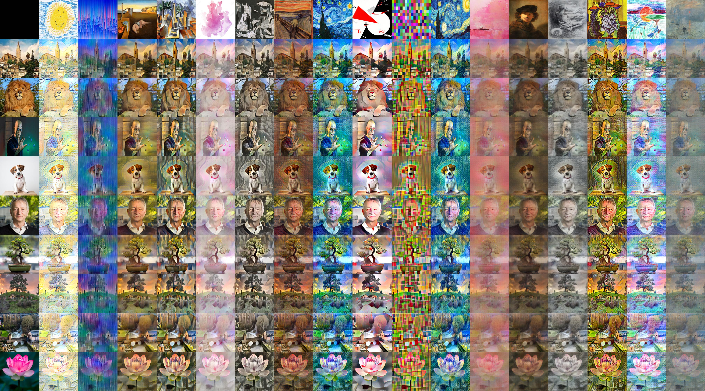

# AdaIN: Arbitrary Style Transfer in Real-time with Adaptive Instance Normalization



[paper](https://arxiv.org/abs/1703.06868)

### Train script

You don't need much more parameters to do the training. You can check them out in the script itself.

If you want, the training script also supports mixed precision, just add the `--mixed_precision` flag.

````python
python train.py --experiment name
````


### Test inference script

The following script creates a transfer-style matrix between different content and style images.

````python
python test.py --weights_path WEIGHTS_PATH \
	--image_content_path IMAGE_CONTENT_PATH \
	--image_style_path IMAGE_STYLE_PATH \
	--alpha 0.75 \
	--device 0
````


